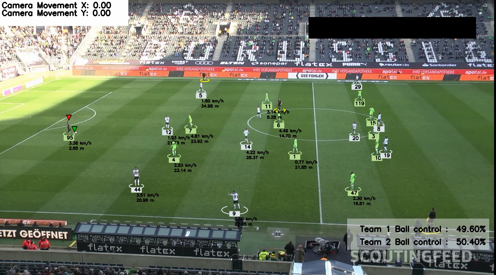

# FootyFlow
## Football-Analysis-system-with-YOLO

## Introduction
The primary goal of this project is to identify and monitor players, referees, and footballs in a video using YOLO, a leading AI object detection model. We plan to train the model further to enhance its performance. We will use K-means for pixel segmentation and clustering to categorize players into teams based on the colors of their uniforms. This data will enable us to determine each team's ball possession percentage during a match. Additionally, optical flow will be utilized to track camera movement across frames, allowing us to accurately gauge a player's movements. Perspective transformation will also be applied to account for the scene's depth and perspective, enabling us to measure a player's movement in meters instead of pixels. Ultimately, we will calculate a player's speed and the distance they cover.

## Trained Models
- [Trained Yolo v5](https://colab.research.google.com/drive/1XNls_fUpSVWK_RWJgyMhsxQjoh9gRMOd?usp=sharing)

## Modules Used
This project employs the following modules:

- **YOLO:** An AI object detection model for detecting and tracking players, referees, and footballs in video footage.
- **K-means:** Used for pixel segmentation and clustering to identify the colors of players' uniforms and group them into teams.
- **Optical Flow:** Utilized to measure camera movement between video frames, allowing for accurate tracking of player movement.
- **Perspective Transformation:** Applied to represent the depth and perspective of the scene, enabling measurements of player movement in real-world units like meters.
- **Speed and Distance Calculation:** Used to calculate the speed and distance covered by each player throughout the match.

  
## Requirements
To execute this project, you must have the following dependencies installed:

- Python 3.x
- Ultralytics
- Supervision
- OpenCV
- NumPy
- Matplotlib
- Pandas
